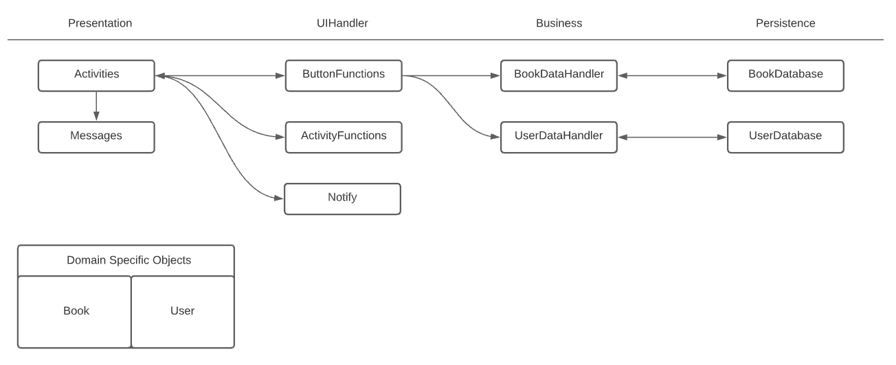

# Architecture

**Activities** handle the GUI for the app. It includes:
 - MainActivity
 - LoginActivity
 - BookDetailsActivity
 - ContactUsActivity
 - CreateUserActivity
 - DeleteUserActivity
 - UserSettingsActivity

**Messages** is a single class that handles error messaged displayed to the user.

**ButtonFunctions** is a single class that handle the onClick logic for all the activities

**ActivityFunctions** are a collection of class that handle functions specific to certain activities. It indludes:
 - BookDetailsFunctions
 - TrendingPageFunctions

**Notify** is a single class that handle system notifications

**BookDataHandler** is a class that acts as an adapter between the presentation layer and the persistance layer. It handles interactions with the book database.

**UserDataHandler** is a class that acts as an adapter between the presentation layer and the persistance layer. It handles interactions with the book database.

**BookDatabase** contains the connection to the book SQL database.

**UserDatabase** contains the connection to the user SQL database.