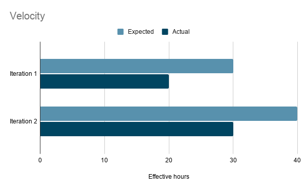

# Retrospective

When talking about the development process, one of the positives that we can definitely take is the planning that we did throughout the course. There were a few times when we couldn't execute our plans properly but we never worked on anything without a plan. But, by the end of the course, we did learn how to implement a plan properly. From the beginning, we distributed the work among ourselves in such a way that everyone could work independently. We had meetings regularly, everyone communicated well, gave updates and talked about issues on regular basis. Members with more technical experience were always there to help other group members that helped to maintain a positive work environment which eventually helped everyone learn something new. 

In iteration 2, our most fatal issue was that we could not get the HSQL database working. Everything that we had planned for Iteration 2 was working properly with the FakeDatabase until we tried to implement HSQLDB into our project. The setup for the SQL database was not done properly which made the app crash and hence affected the functionality of our app a lot. We think one of the major mistakes from our end was that we made everything work with the fake database first and then just tried to inject the HSQL database in the end that eventually made the app crash as mentioned before because it wasn’t set up properly in the first place. First, we plan on improving this by getting rid of all the bugs caused by the broken database.  Afterwards, we can get started working on the rest of Iteration 3. Major part of the improvement will include comparing and looking at the code of sample projects that have been provided by the professors. This would help us to figure out where we went wrong fundamentally in terms of setting up the HSQL database environment. If this plan fails, our second plan is to meet with the professor and discuss the problem. The frequency of meetings for this iteration will be more than previous ones because we want to make sure everything is on the right track. In previous iterations, we didn’t consult with the profs about the problems we were facing and instead relied heavily on our own knowledge to solve them. This resulted in us failing to recognize the core issue in the HSQL and ultimately failing to make it work.

As far as the evaluation of its success is concerned, it will be based on whether the app functions properly without crashing after injecting the HSQL database. The app should function exactly the same way as it did when the fake database was used. Apart from functionality, tests will be required to determine if it works correctly. If all the tests associated with the HSQL database pass without any errors, then that would mean the problem is fixed. 

Despite the problems from the last iteration, our velocity was improved over iteration 1. As you can see from the chart, we were over ambitious in our expectations for the first iteration. In iteration 2, we were still able to implement features that were not database related. 

